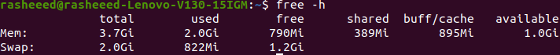
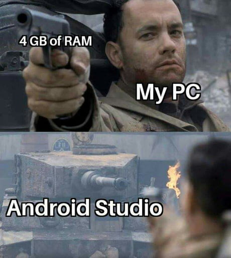

Getting started with [Flutter](flutter.dev) development on a low-end PC is very frustrating. Earlier this year when I wanted to learn mobile development with Flutter, it was pretty challenging for me to have only my IDE open without even trying to open another window (e.g. a Browser) my laptop will just freeze 😢 because I am using a Lenovo V130-15IGM laptop with Intel Celeron N4000 1.1ghz dual processor and 4 GB ram. In this post, I will share tips to make it possible to start developing amazing apps with Flutter 😉.

:::note
All the tips stated here are just what works for me, so It might not work for you. If you have any other suggestions let me know in the comment section 😉.
:::

## 1. Install a distribution of the Linux operating system and create Swap memory

The Linux operating system is the best known and most used open-source operating system, you might have probably heard about the very cool features of the Linux OS for software development 😎. Just like Windows and macOS, Linux also has a very good graphical user interface, compared to other operating systems Linux comes in different flavours with different distributions, there are many choices to make with Linux distros, but the one I can suggest for a beginner is either of [Ubuntu](https://ubuntu.com/download/desktop) or [elementary OS](https://elementary.io/).

I am not suggesting the installation of Linux just because I use Linux, but because it is fast and secure, and it uses fewer resources compared with Windows (you can find out yourself here 🤨 🤔). If you are using Windows, you can dual boot with any Linux distro you choose, but since we are only concerned with Ubuntu here is [how to dual boot your Windows operating system with Ubuntu](https://itsfoss.com/install-ubuntu-1404-dual-boot-mode-windows-8-81-uefi/), and you can delete Windows and install Linux entirely on your computer (back up your data). Installing Linux is not the only topic to discuss in this section. You can make use of the advantage of swap memory. I know you might wonder what the heck is swap and how does it affect my RAM

> A swap memory is a backup support RAM used whenever it runs out of space, and it is always a part of secondary storage (the ROM) and it helps improve performance. It is of two types swap partition and swap files

If you install the Ubuntu distribution, it helps you create a 2 GB storage of swap partition automatically, so you might not need to create a swap. You can run `free -h` in your terminal to see it. If you have a swap already created, you should have the result below after running the command.

**Note** if you are on a Windows machine you can also make use of this advantage by creating virtual memory on Windows, find out about swap memory on Windows here.

## 2. Use VS Code instead of Android Studio

The Visual Studio Code is a lightweight code editor by Microsoft, which can be configured for development in any programming language. You might know the fact that the Android Studio is a very good consumer when it comes to RAM and processor, which might be quite annoying for someone using a 4 GB RAM laptop because the least recommended RAM storage for the android studio itself is 8 GB (see it [here](https://developer.android.com/studio)). But don't worry since the Visual Studio Code (VS Code) is also one of the recommended text editors, so without wasting much time you can get VS Code [here](https://code.visualstudio.com/) and get hands-on setting it up for your development [here](https://docs.flutter.dev/get-started/editor?tab=vscode).

You can also make use of [Emacs as your IDE for Flutter development](https://docs.flutter.dev/get-started/editor?tab=emacs) and if you are a Vim fan, you can check this Robert Brunhage's article on how to set up Vim for Flutter development [here](https://robertbrunhage.com/videos/how-to-setup-vim-for-flutter)

## 3. Use a physical mobile device instead of the Emulator

Another resource consumer in mobile development is the Android emulator, as it takes more space in the RAM when being run. But there is a solution to that since there is an option of using a physical mobile device for running and debugging your app. To set up your mobile device for this, [enable USB debugging for your phone](https://www.makeuseof.com/tag/what-is-usb-debugging-mode-on-android-makeuseof-explains/).

## 4. Upgrade your computer

The best and lasting solution is to either increase the size of your RAM and change your HDD to SSD or buy another PC with higher specifications.

Wishing you all the best in your Flutter journey 🎉 🎉.
